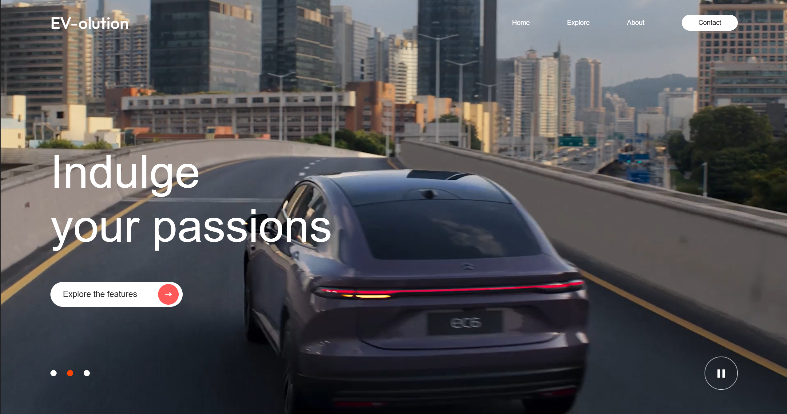

# EV Website — Header Design

A responsive website header built with React and Vite, featuring an animated hero section with dynamic content and playback controls.



## Features

- Animated hero section with rotating content
- Play / pause controls
- Navigation dots for manual slide switching
- Clean responsive layout

## Tech Stack

- React
- Vite
- CSS
- JavaScript

## Getting Started

```bash
npm install
npm run dev
```